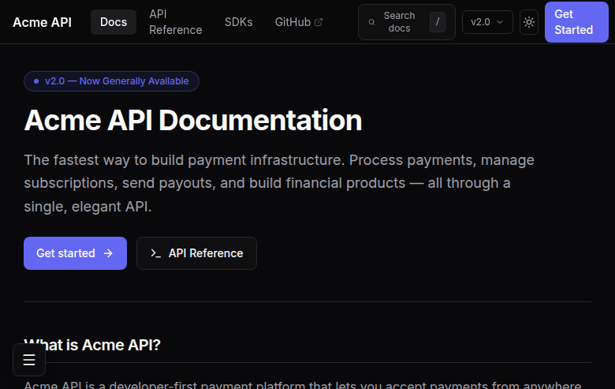
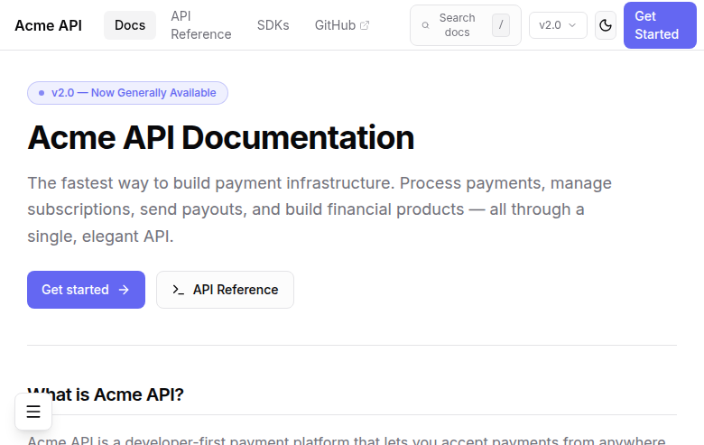
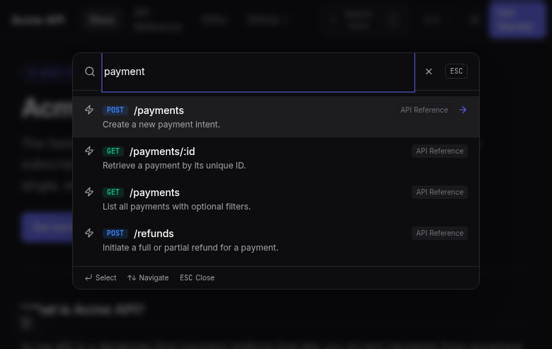

<div align="center">


# Scribe

**Beautiful documentation, zero vendor lock-in.**

The open-source alternative to Mintlify — built on Next.js App Router.

[](LICENSE)
[](https://nextjs.org)
[](https://www.typescriptlang.org)
[](https://tailwindcss.com)

[Demo](https://scribe-docs.vercel.app) · [Quick Start](#quick-start) · [Components](#components) · [Configuration](#configuration)

</div>

---

### Dark Mode (default)



### Light Mode



### Built-in Search



---

## Why Scribe?

| | Mintlify | Docusaurus | Nextra | Fumadocs | **Scribe** |
|---|---|---|---|---|---|
| **Price** | $150+/mo | Free | Free | Free | **Free** |
| **Framework** | Proprietary | React (CRA) | Next.js (Pages) | Next.js | **Next.js App Router** |
| **Self-hosted** | No | Yes | Yes | Yes | **Yes** |
| **Dark mode** | Yes | Plugin | Yes | Yes | **Built-in** |
| **API docs component** | Yes | No | No | Plugin | **Built-in** |
| **Code tabs** | Yes | Plugin | No | Plugin | **Built-in** |
| **Full-text search** | Paid add-on | Plugin | Built-in | Built-in | **Built-in** |
| **Vendor lock-in** | Yes | No | No | No | **No** |
| **Server Components** | No | No | Partial | Yes | **Yes** |
| **shadcn/ui compatible** | No | No | No | Partial | **Yes** |
| **Setup time** | 10 min | 30 min | 15 min | 20 min | **5 min** |

### The problem

You want docs that look as polished as Mintlify. But you don't want to pay $150/month, host your content on someone else's servers, or get locked into a proprietary platform that can change pricing on you overnight.

### The solution

Scribe gives you Mintlify-quality docs with full ownership. Clone, customize, deploy anywhere. MIT licensed — forever free.

---

## Quick Start

```bash
# Clone the template
git clone https://github.com/RapierCraft/scribe.git my-docs
cd my-docs

# Install dependencies
npm install

# Start developing
npm run dev
```

Open [http://localhost:3000/docs](http://localhost:3000/docs) and start writing.

**Your first page lives at** `src/app/docs/page.mdx`. Edit it and the browser updates instantly.

---

## Components

Scribe ships with **10+ pre-built components** designed for technical documentation. Drop them directly into any `.mdx` file.

### Callout

Four types — `info`, `warning`, `success`, `danger` — with icons and accessible color coding.

```tsx
import { Callout } from "@/components/content/Callout";

<Callout type="warning" title="Breaking Change">
  The `v2` API requires authentication for all endpoints.
  Update your client before upgrading.
</Callout>
```

### Code Tabs

Multi-language code examples with syntax highlighting, a language switcher, and a one-click copy button.

```tsx
import { CodeTabs } from "@/components/content/CodeTabs";

<CodeTabs
  examples={[
    {
      language: "javascript",
      label: "JavaScript",
      code: `const res = await fetch("/api/data");\nconst data = await res.json();`,
    },
    {
      language: "python",
      label: "Python",
      code: `import requests\ndata = requests.get("/api/data").json()`,
    },
    {
      language: "bash",
      label: "cURL",
      code: `curl https://api.example.com/data`,
    },
  ]}
/>
```

### API Endpoint

Structured API documentation with HTTP method badges, parameter tables, and collapsible request/response examples.

```tsx
import { ApiEndpoint } from "@/components/content/ApiEndpoint";

<ApiEndpoint
  method="POST"
  path="/api/v1/users"
  description="Create a new user account and return the user object."
  parameters={[
    { name: "email", type: "string", required: true, description: "User's email address." },
    { name: "name", type: "string", required: false, description: "Display name shown in the UI." },
    { name: "role", type: '"admin" | "member"', required: false, description: "Defaults to member." },
  ]}
  requestExample={`curl -X POST https://api.example.com/v1/users \\
  -H "Authorization: Bearer sk_live_..." \\
  -H "Content-Type: application/json" \\
  -d '{"email": "user@example.com", "name": "Jane"}'`}
  responseExample={`{
  "id": "usr_01J8X...",
  "email": "user@example.com",
  "name": "Jane",
  "role": "member",
  "created_at": "2024-11-01T12:00:00Z"
}`}
/>
```

### Steps

Numbered step-by-step instructions with optional code snippets per step.

```tsx
import { Steps } from "@/components/content/Steps";

<Steps
  steps={[
    {
      title: "Install",
      description: "Add Scribe to your project.",
      code: "git clone https://github.com/RapierCraft/scribe.git my-docs",
    },
    {
      title: "Configure",
      description: "Edit scribe.config.ts with your site name, logo, and navigation.",
    },
    {
      title: "Write",
      description: "Add .mdx files to src/app/docs/. Scribe picks them up automatically.",
    },
    {
      title: "Deploy",
      description: "Push to GitHub. Connect to Vercel. Done.",
    },
  ]}
/>
```

### Cards

Navigation cards with icons and hover effects — ideal for landing pages and category indexes.

```tsx
import { Card, CardGrid } from "@/components/content/Card";
import { BookOpen, Code2, Rocket, Palette } from "lucide-react";

<CardGrid>
  <Card
    title="Quick Start"
    description="Get up and running in 5 minutes."
    href="/docs/getting-started/quickstart"
    icon={Rocket}
  />
  <Card
    title="API Reference"
    description="Complete endpoint documentation with examples."
    href="/docs/api/endpoints"
    icon={Code2}
  />
  <Card
    title="Guides"
    description="In-depth tutorials for common workflows."
    href="/docs/guides"
    icon={BookOpen}
  />
  <Card
    title="Theming"
    description="Customize colors, fonts, and layout."
    href="/docs/guides/theming"
    icon={Palette}
  />
</CardGrid>
```

### Also included

| Component | Description |
|---|---|
| **CodeBlock** | Syntax highlighting for 30+ languages, copy button, optional line highlighting |
| **Table of Contents** | Auto-generated right sidebar, scroll-tracking active state |
| **Search** | Full-text search with keyboard navigation (`/` to open) |
| **Theme Toggle** | Dark / light / system mode with zero flash |
| **Version Switcher** | Dropdown to switch between API versions |
| **Sidebar** | Collapsible groups, badge support, external link indicators |
| **MDX Components** | Pre-styled headings, tables, lists, blockquotes, inline code |

---

## Configuration

Everything is controlled from a single file: `scribe.config.ts`. No scattered config files, no env juggling.

```typescript
import { ScribeConfig } from "./src/lib/types";

const config: ScribeConfig = {
  // Site metadata
  name: "My Product",
  description: "The fastest way to ship your API.",
  url: "https://docs.myproduct.com",

  // Branding
  logo: {
    light: "/logo-light.svg",
    dark: "/logo-dark.svg",
    text: "My Product",
  },

  // Theme — CSS variable overrides
  theme: {
    primaryColor: "#6366f1",  // Any hex color
    font: "Inter",
    monoFont: "JetBrains Mono",
    radius: "0.5rem",
  },

  // Sidebar navigation
  navigation: [
    {
      title: "Getting Started",
      items: [
        { title: "Introduction", href: "/docs" },
        { title: "Installation", href: "/docs/installation" },
        { title: "Quick Start", href: "/docs/quickstart" },
      ],
    },
    {
      title: "API Reference",
      items: [
        { title: "Endpoints", href: "/docs/api/endpoints" },
        { title: "Authentication", href: "/docs/api/auth" },
        { title: "SDKs", href: "/docs/api/sdks", badge: "New" },
      ],
    },
  ],

  // Top navigation bar
  topNav: [
    { href: "/docs", label: "Docs" },
    { href: "/docs/api/endpoints", label: "API Reference" },
    { href: "https://github.com/yourorg/yourrepo", label: "GitHub", external: true },
  ],

  // CTA buttons in the header
  actions: {
    primaryButton: { label: "Get Started", href: "/docs/installation" },
    secondaryButton: { label: "GitHub", href: "https://github.com/yourorg/yourrepo" },
  },

  // Search
  search: { enabled: true, shortcut: "/" },

  // Version switcher
  versions: ["v2.0", "v1.9", "v1.8"],

  // Footer
  footer: {
    links: [
      { title: "GitHub", href: "https://github.com/yourorg/yourrepo" },
      { title: "Discord", href: "https://discord.gg/yourserver" },
      { title: "Twitter", href: "https://twitter.com/yourhandle" },
    ],
    copyright: "Your Company, Inc.",
  },
};

export default config;
```

---

## Theming

Scribe uses CSS variables compatible with [shadcn/ui](https://ui.shadcn.com). Drop in any shadcn component — it works without any wiring.

```css
/* globals.css — light mode */
:root {
  --background: 0 0% 100%;
  --foreground: 240 10% 3.9%;
  --primary: 239 84% 67%;        /* indigo-500 — change to your brand */
  --primary-foreground: 0 0% 98%;
  --muted: 240 4.8% 95.9%;
  --muted-foreground: 240 3.8% 46.1%;
  --border: 240 5.9% 90%;
  --radius: 0.5rem;
}

/* Dark mode */
.dark {
  --background: 240 10% 3.9%;
  --foreground: 0 0% 98%;
  --primary: 239 84% 67%;
  --muted: 240 3.7% 15.9%;
  --muted-foreground: 240 5% 64.9%;
  --border: 240 3.7% 15.9%;
}
```

Change `--primary` to your brand color and every component updates automatically.

---

## Deploy

Scribe is a standard Next.js app. It deploys anywhere Next.js runs.

| Platform | Command |
|---|---|
| **Vercel** | `vercel deploy` — zero config |
| **Netlify** | `netlify deploy --build` |
| **Cloudflare Pages** | Connect GitHub repo, set build command `npm run build` |
| **Docker** | `docker build -t my-docs . && docker run -p 3000:3000 my-docs` |
| **Self-hosted** | `npm run build && npm start` |
| **Static export** | Add `output: "export"` to `next.config.js`, then `npm run build` |

---

## Project Structure

```
my-docs/
├── src/
│   ├── app/
│   │   ├── docs/                    # Your documentation pages (.mdx)
│   │   │   ├── page.mdx             # /docs — root page
│   │   │   ├── getting-started/
│   │   │   │   ├── installation/
│   │   │   │   │   └── page.mdx
│   │   │   │   └── quickstart/
│   │   │   │       └── page.mdx
│   │   │   └── api/
│   │   │       └── endpoints/
│   │   │           └── page.mdx
│   │   ├── layout.tsx               # Root layout with ThemeProvider
│   │   └── globals.css              # CSS variables + Tailwind base
│   ├── components/
│   │   ├── content/                 # Documentation components
│   │   │   ├── ApiEndpoint.tsx      # API method/path/params/examples
│   │   │   ├── Callout.tsx          # Info/warning/success/danger blocks
│   │   │   ├── Card.tsx             # Card + CardGrid navigation cards
│   │   │   ├── CodeBlock.tsx        # Syntax-highlighted code with copy
│   │   │   ├── CodeTabs.tsx         # Multi-language tabbed examples
│   │   │   └── Steps.tsx            # Numbered step sequences
│   │   ├── layout/
│   │   │   ├── DocsLayout.tsx       # Sidebar + main + TOC shell
│   │   │   └── TableOfContents.tsx  # Right sidebar, scroll-tracked
│   │   └── navigation/
│   │       ├── Search.tsx           # Full-text search dialog
│   │       ├── Sidebar.tsx          # Left sidebar with groups + badges
│   │       ├── ThemeToggle.tsx      # Dark/light/system switcher
│   │       ├── TopBar.tsx           # Header with nav links + actions
│   │       └── VersionSwitcher.tsx  # API version dropdown
│   └── lib/
│       ├── config.ts                # Config loader
│       ├── types.ts                 # ScribeConfig type definitions
│       └── utils.ts                 # cn(), slugify(), etc.
├── public/
│   └── scribe-logo.svg
├── scribe.config.ts                 # Your configuration (one file)
├── mdx-components.tsx               # Global MDX component overrides
├── next.config.mjs                  # Next.js + MDX setup
├── tailwind.config.ts
└── tsconfig.json
```

---

## Philosophy

**Own your docs.** No vendor lock-in, no surprise pricing, no "please contact sales." Your documentation lives in your Git repository — version-controlled, reviewable, portable.

**Components over raw Markdown.** Technical documentation needs rich, interactive elements: multi-language examples, parameter tables, step sequences, callouts. Scribe ships all of them, ready to drop into any `.mdx` file.

**Convention over configuration.** One config file controls everything. Sensible defaults out of the box, with clean escape hatches when you need to go further.

**Next.js native.** Server Components, App Router, streaming — no legacy React patterns. Scribe runs the same stack you're already deploying.

---

## Contributing

Contributions are welcome. See [CONTRIBUTING.md](CONTRIBUTING.md) to get started.

```bash
git clone https://github.com/RapierCraft/scribe.git
cd scribe
npm install
npm run dev
```

Open [http://localhost:3000/docs](http://localhost:3000/docs) — any changes to `src/` hot-reload instantly.

---

## License

[MIT](LICENSE) — use it for anything, forever.

---

<div align="center">

Built by [RapierCraft](https://github.com/RapierCraft)

If Scribe saved you from a $150/mo docs bill, a star helps others find it.

⭐ [Star Scribe on GitHub](https://github.com/RapierCraft/scribe)

</div>
